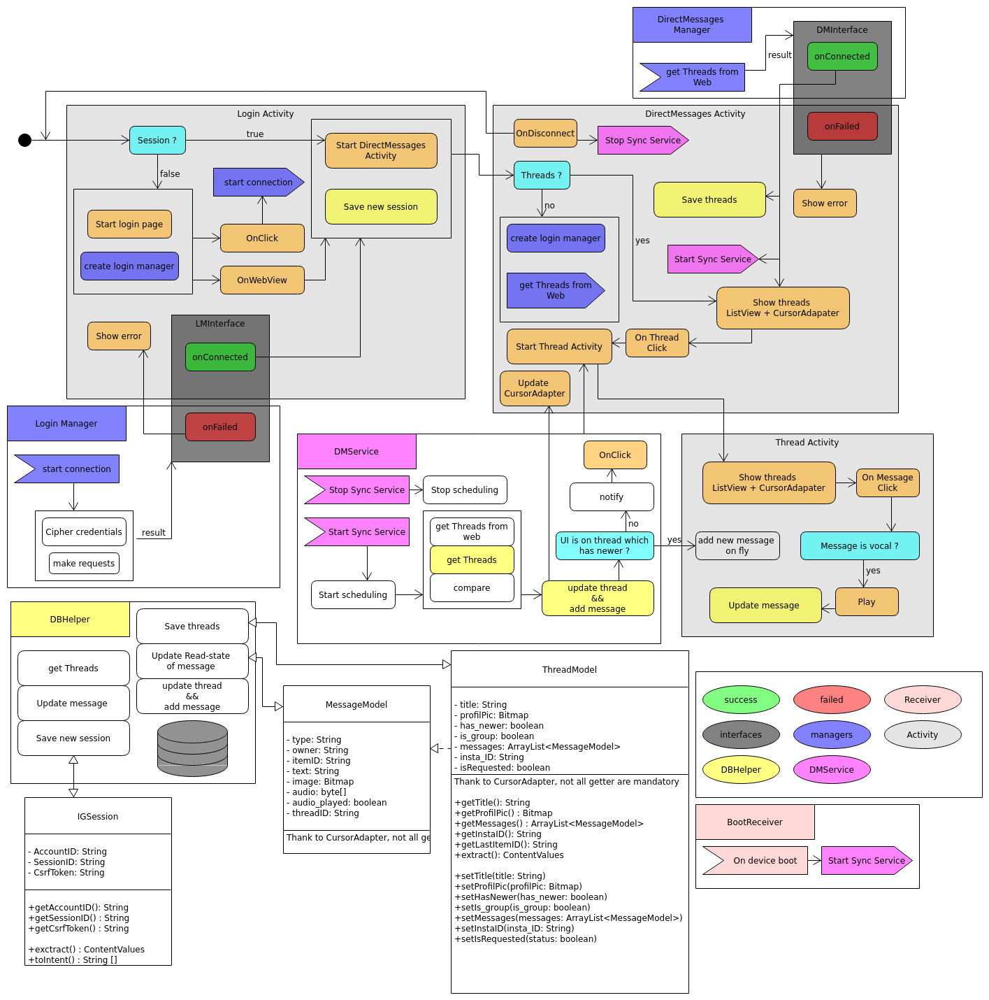

 

### DISCLAIMER : if you stumbled here looking for an application to replace the original, use Barinsta, not mine. It's not meant to be used, it's just a personal project to show what I can do

# InstagramDM
My first android app
## Why
First, I consider that i'm an instagram addict. So I told myself that I had to uninstall this evil app. But instagram's direct messages represent a main commnication 
way for me and my friend. So I searched a way to keep instagram DM without instagram app. But I had found nothing so I started to learn android coding.

## How
I had no idea how to do this. But thank to internet and stackoverflow, everything is possible. I reuse my old android from scratch project to start.

## Workflow

